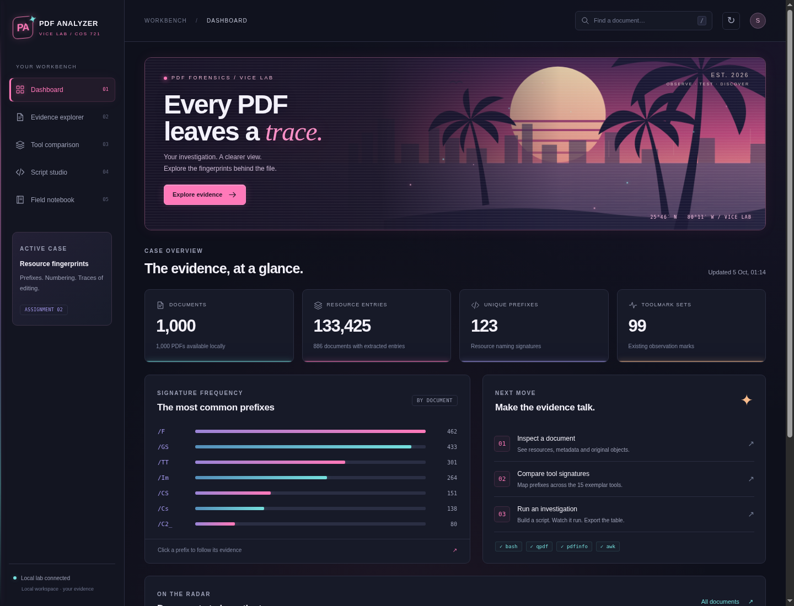
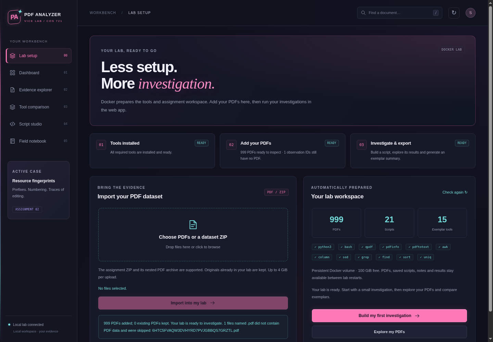

# PDF Analyzer · Vice Lab
To use this lab online you will need a lab access key please contact: shnaidoo1908@gmail.com for the access key 

A local GUI for COS 721 PDF toolmark investigations, with a synthwave interface, neon effects, script editing, live investigation output, searchable evidence tables, and CSV exports.

PDF buttons export evidence, comparisons, result tables, summaries, document views, notes and complete runs. The local Docker lab keeps your workspace in a persistent volume.

Use **Script studio → Investigation results → Generate summary** to summarize a full saved result table across exemplar tools. Compare row counts, distinct PDFs and observed coverage in a table and interactive bar chart; export the summary as CSV or the chart as SVG. See [Summarize a large investigation](pdf-analyzer/README.md#summarize-a-large-investigation).

Click a PDF to use **Strings & tags** for searchable file strings, decoded dictionaries, exact PDF tags, page text, and stream previews. **Metadata** shows document properties, custom Info fields, trailer identifiers, and XMP, with JSON and CSV exports. See [Look inside a PDF](pdf-analyzer/README.md#look-inside-a-pdf) for a walkthrough.



## Start the Docker lab

Install Docker once. The launcher then builds the lab, installs Python, Bash, qpdf, Poppler and the shell tools, starts the web app, and opens <http://localhost:8080>. You do not need to install the PDF tools on your computer.

**Kali Linux:** the package is `docker.io`, not `docker` or `wmdocker`. Follow the [official Kali Docker guide](https://www.kali.org/docs/containers/installing-docker-on-kali/):

```bash
sudo apt update
sudo apt install -y docker.io docker-compose
sudo systemctl enable --now docker
sudo usermod -aG docker "$USER"
```

Log out and back in so the Docker group takes effect. Confirm `docker info` and `docker compose version` work without sudo. On Windows or macOS, install and start [Docker Desktop](https://www.docker.com/products/docker-desktop/).

Open this repository in VS Code and choose **Ctrl+Shift+P → Tasks: Run Task → Start PDF Analyzer (Docker)**. Alternatively run **Start Lab.sh** on Linux, double-click **Start Lab.command** on macOS, or **Start Lab.cmd** on Windows. Linux file managers may require **Run as a program**; the VS Code task avoids that setting. First launch needs internet access to download the container and tools.

You can also launch with:

```bash
docker compose up -d --build --wait
```

## Set up and investigate in the browser

1. Open **Lab setup**. The app checks the tools and prepares the included observation scripts and exemplar sets automatically.
2. Select or drop your assignment dataset ZIP or PDF files, then click **Import into lab**. The outer assignment ZIP containing `lcwa_gov_pdf_data.zip` works directly. Upload progress and import status appear in the app.
3. Click **Build first investigation**. Review the generated script in Script studio, then choose **Run investigation**. Use **Explore PDFs** for strings, tags, objects and metadata.
4. Use **Generate summary** on a detailed result table for a readable exemplar table and interactive bar chart.

Imports preserve original PDF bytes. Files named `.pdf` without PDF content (such as downloaded HTML error pages) are skipped and listed in the import report. Reimporting identical PDFs skips them; conflicting document IDs give an error without replacing originals. IDs use the first five alphanumeric filename characters; shorter names get a hash-based ID. New PDFs are added to the investigation list, but exemplar membership stays as supplied by the assignment. Imported personal PDFs appear as **Unassigned** until you add their IDs to an appropriate `tools/pr*` set using a custom script.

PDFs, scripts, notes and results live in the persistent Docker volume `pdf-analyzer_lab-data`. Stop with **Stop PDF Analyzer (Docker)** or `docker compose stop`; starting again keeps your work. To copy a backup out of a running lab:

```bash
docker compose cp lab:/workspace ./lab-backup
```

`docker compose down` also keeps the volume. `docker compose down -v` deletes the saved lab, so use it only when intentionally resetting everything. The Docker lab has its own workspace; existing native runs and notes are not migrated automatically. Import your existing corpus through the web app to start using it.

The web app is bound to your own computer. Scripts run as the container's `lab` user, with the lab workspace writable. Your computer's directories and Docker control socket are not mounted into the container. Choose another browser port by setting `LAB_PORT` before launching, for example `LAB_PORT=8081 bash 'Start Lab.sh'` on Linux/macOS.



## Native launch (optional)

The original **Start PDF Analyzer** VS Code task and `python3 pdf-analyzer/server.py --open` still open <http://127.0.0.1:8766>. This mode requires the tools installed locally. **Lab setup** can import PDFs here too; storage stays in `environment_set`. See the [app README](pdf-analyzer/README.md) for paths and details.

The original corpus, assignment briefs, archives, generated results and personal notes are excluded from Git. Observation scripts and baseline sets are included. The script guide references `assign2.pdf`; supply your assignment brief locally for that link.

## Guides

- [Assignment 2: step-by-step lab evidence guide](ASSIGNMENT_2_LAB_GUIDE.md)
- [App usage and evidence interpretation](pdf-analyzer/README.md)
- [Detailed script-building guide](pdf-analyzer/README_SCRIPT_BUILDER.md)
- [Copyable investigation scripts](pdf-analyzer/examples/)

## Validation

```bash
python3 -m unittest discover -s pdf-analyzer -v
```

The 36 tests use isolated fixture data and check original references, resource scopes, filtering and exports, script execution, cancellation, persistence, result isolation, strings and compressed content, custom metadata/XMP, preservation of original PDFs, full-table exemplar summaries, nested ZIP imports, authenticated uploads, conflict handling and container paths. Drive checks use real rclone transfers to temporary local storage to verify snapshots, restore, interrupted commits, original-file checksums, credential handling and paused edits during transfers. These six transfer tests require rclone (included in Docker) and skip when it is unavailable; live Google authorization is configured separately.
